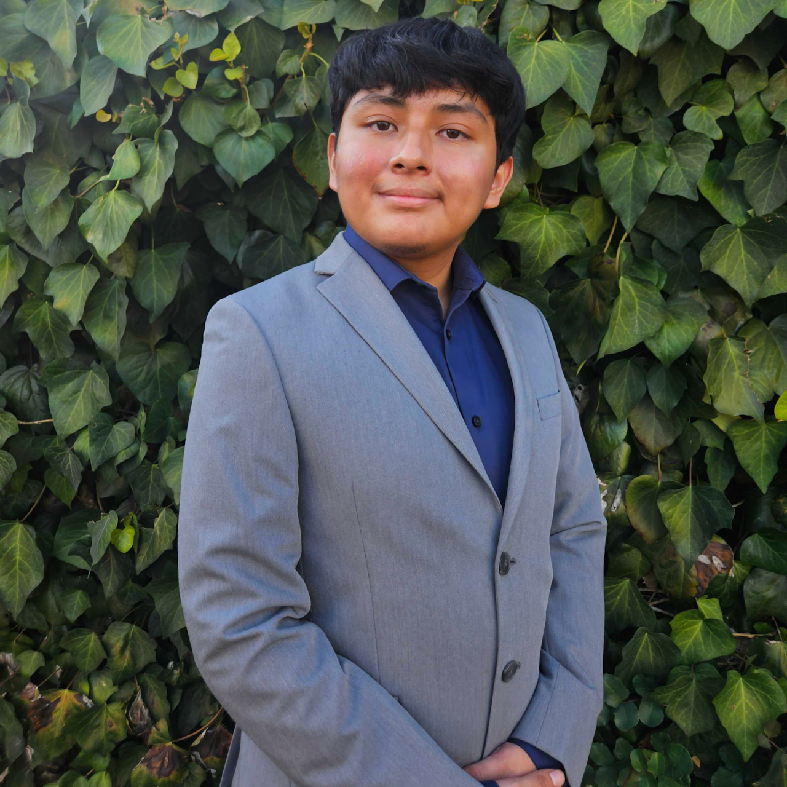

::: hero-section
{.profile-home width="320px"}

# Uriel Santa Cruz

Statistics & Data Science Student at UCLA

I’m a UCLA student interested in data analysis, machine learning, and using data to solve real-world problems. My work focuses on building clear insights from complex datasets using Python, R, SQL, Tableau, and statistical modeling.

I’m especially interested in projects that combine technical analysis with real-world impact, including media analytics, social trends, business intelligence, and data visualization.

[View My Projects](projects.qmd){.btn-custom} [Resume & Contact](resume.qmd){.btn-custom-outline}
:::

------------------------------------------------------------------------

## Skills & Interests

::::::: grid
::: card-custom
### Programming

Python, R, SQL, C++, Git
:::

::: card-custom
### Data Science

Statistical modeling, regression analysis, machine learning, neural networks, exploratory data analysis
:::

::: card-custom
### Tools

Pandas, NumPy, Scikit-learn, TensorFlow, Tableau, Quarto, GitHub
:::

::: card-custom
### Interests

Data science, machine learning, business analytics, data visualization, media and technology, public-sector applications
:::
:::::::

------------------------------------------------------------------------

## Featured Projects

:::::: grid
::: card-custom
### YouTube Virality Predictor

Built a machine learning model in Python to predict whether a YouTube video would become viral using large-scale metadata and text-based features.

[View Project](projects.qmd)
:::

::: card-custom
### Los Angeles Housing Price Analysis

Analyzed housing price patterns across Los Angeles using spatial data, regression modeling, and data visualization.

[View Project](projects.qmd)
:::

::: card-custom
### Movie Box Office Regression

Used multiple linear regression in R to study how movie reviews and related features influenced box office revenue.

[View Project](projects.qmd)
:::
::::::

------------------------------------------------------------------------

## What I Hope to Build

As I continue developing my experience in statistics and data science, I hope to work on projects that are not only technically strong but also meaningful and accessible. I’m interested in using data to support better decisions, uncover important patterns, and communicate insights clearly to different audiences.

[See All Projects →](projects.qmd){.btn-custom}
